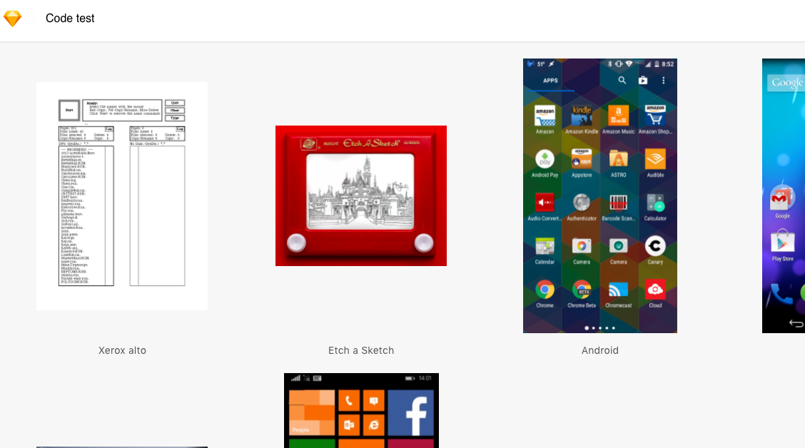
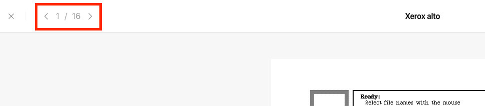
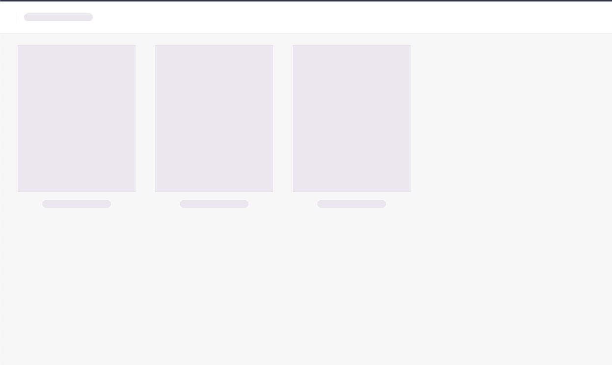

# Sketch Front-End Developer Challenge

This is a front end challenge for Sketch.

The initial setup/boilerplate was done with [Create React App](https://create-react-app.dev/) and the tech stack used for this project consist mainly of:
* React (with TypeScript 💖)
* [Styled Components](https://styled-components.com/) for styling 💅
* [Cypress](https://www.cypress.io/) for integration testing
* [Apollo](https://www.apollographql.com/) as a GraphQL client

## Install

In order to get the project started, after cloning the repo, make sure you install all the `npm` dependencies by running:
```
npm i
```

Then all you have to do is run:
```
npm start
```
The app should now be running on [https://localhost:3000](https://localhost:3000) (by default)

### Walkthrough

#### Document View



As soon as you're head to <https://localhost:3000> you should be redirected to the default document's page (id: `e981971c-ff57-46dc-a932-a60dc1804992`).

There you can check out all the artboards associated with the document.

All the artboards presented can be clicked on in order to be viewed in a more detailed page (Artboard View).

#### Artboard View

In the artboard view page you should be able to see the artboard you clicked in the previous page as well as navigate through all the available artboards by clicking the navigation arrows.



Clicking the Cross button (on the top left) should send you back to the document view page.

## We got tests!

Get [Cypress](https://www.cypress.io/) started to take this bad boy for a spin:

```
npx cypress open
```

## Extras

* "Bonus" document: simply replace the id in the url with an alternative document id (ie `http://localhost:3000/document/40432a93-5434-4059-87b9-545fd1ad6ee0`)
* Skeleton UI: during the data fetching/loading a skeleton UI is displayed 
* Responsive: try resizing your browser window to see how the app adapts
* Each document and artboard have their own url, so passing their respective `id` in the url will send the user to the respective page
* Fallback routes for whenever a document or artboard `id` is not found
* Integration Tests using Cypress

## To Improve

* Tests could be more thorough with some screenshot testing and testing the fallback routes for when the artboard and document `ids` are not valid
